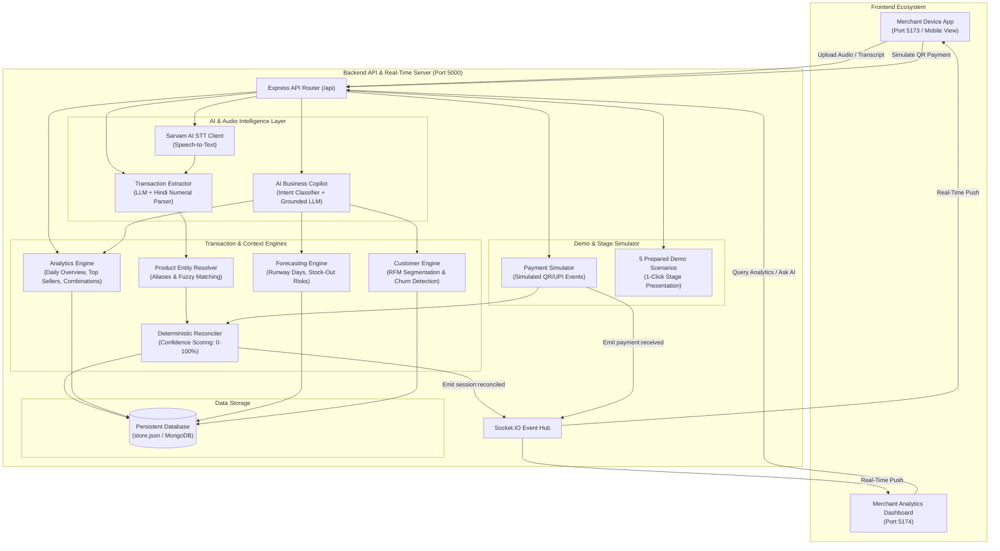
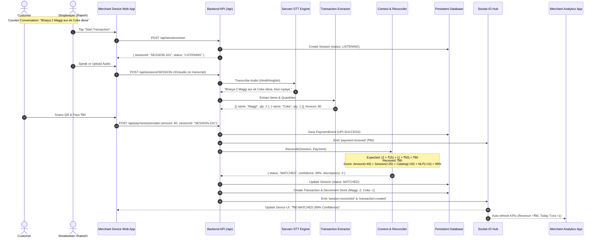
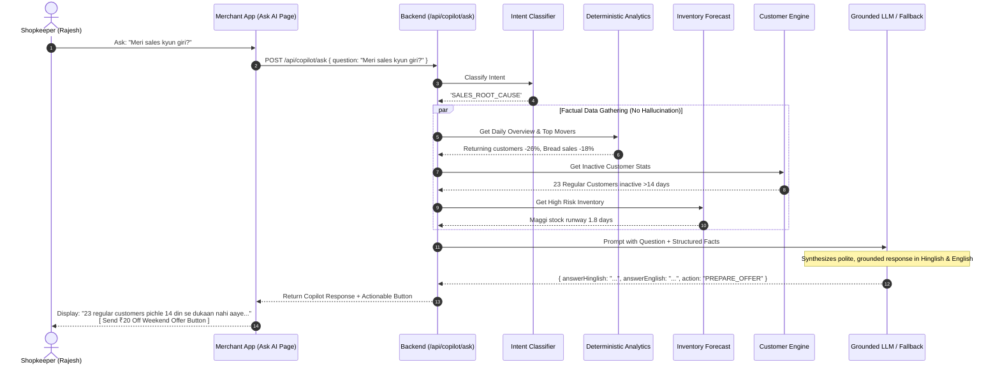
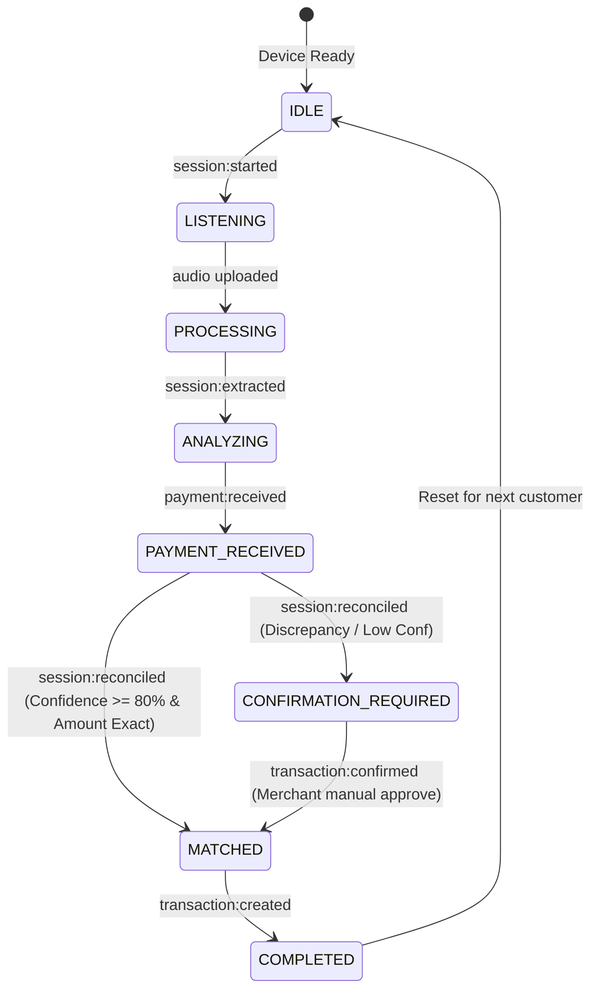

# Paytm Commerce Intelligence (Paytm Vyapar AI) — Backend Documentation

**Paytm Commerce Intelligence** is an AI-native merchant intelligence platform designed for India's small and micro businesses (kiranas, retail shops).

> **"Every payment tells you how much. Every conversation tells you what. We connect both."**

This document provides a comprehensive breakdown of all backend components, engines, data models, API endpoints, Mermaid architecture and sequence diagrams, and step-by-step verification instructions.

---

## Table of Contents
1. [System Architecture Overview](#1-system-architecture-overview)
2. [Mermaid Diagrams](#2-mermaid-diagrams)
   - [2.1 End-to-End System Architecture](#21-end-to-end-system-architecture)
   - [2.2 Transaction Audio & Payment Reconciliation Sequence](#22-transaction-audio--payment-reconciliation-sequence)
   - [2.3 AI Copilot Grounded Reasoning Flow](#23-ai-copilot-grounded-reasoning-flow)
   - [2.4 Real-Time WebSocket Event Lifecycle](#24-real-time-websocket-event-lifecycle)
3. [Core Engines & Functions Deep-Dive](#3-core-engines--functions-deep-dive)
   - [3.1 Product Entity Resolver (`ProductResolver`)](#31-product-entity-resolver-productresolver)
   - [3.2 Deterministic Reconciliation Engine (`ReconciliationEngine`)](#32-deterministic-reconciliation-engine-reconciliationengine)
   - [3.3 Speech-to-Text (`SarvamSTTClient`)](#33-speech-to-text-sarvamsttclient)
   - [3.4 Transaction Extractor (`TransactionExtractor`)](#34-transaction-extractor-transactionextractor)
   - [3.5 AI Business Copilot (`AICopilotEngine`)](#35-ai-business-copilot-aicopilotengine)
   - [3.6 Deterministic Analytics Engine (`AnalyticsEngine`)](#36-deterministic-analytics-engine-analyticsengine)
   - [3.7 Inventory Forecasting Engine (`ForecastingEngine`)](#37-inventory-forecasting-engine-forecastingengine)
   - [3.8 Customer & Lost Sales Engine (`CustomerEngine`)](#38-customer--lost-sales-engine-customerengine)
   - [3.9 Payment Simulator (`PaymentSimulator`)](#39-payment-simulator-paymentsimulator)
   - [3.10 Stage Demo Scenarios & Reset Manager](#310-stage-demo-scenarios--reset-manager)
   - [3.11 Socket.IO Real-Time Manager (`SocketManager`)](#311-socketio-real-time-manager-socketmanager)
4. [Complete API Reference](#4-complete-api-reference)
5. [How to Verify Each Function Step-by-Step](#5-how-to-verify-each-function-step-by-step)

---

## 1. System Architecture Overview

The backend is built with **Node.js, Express, TypeScript, and Socket.IO**. It is designed to run locally on a laptop with zero external hardware or database dependencies, while being fully extensible for cloud MongoDB and live Sarvam/LLM API keys.

```text
d:\AI_for_india\server\
├── src/
│   ├── ai/               # Sarvam STT, LLM Client, Extractor, AI Copilot
│   ├── analytics/        # Deterministic Analytics, Forecasting, Customer Segmentation
│   ├── context-engine/   # Product Entity Resolution & Deterministic Reconciliation
│   ├── controllers/      # Route controllers for sessions, payments, analytics, copilot, demo
│   ├── db/               # Persistent atomic JSON database & repository pattern
│   ├── middleware/       # Multer audio uploads & centralized error handling
│   ├── routes/           # Central Express router
│   ├── scripts/          # 30-day realistic seed data & automated test pipeline
│   ├── simulator/        # Demo QR payment simulator & 5 pre-recorded stage scenarios
│   ├── sockets/          # Socket.IO real-time event broadcasting
│   ├── types/            # TypeScript domain interfaces
│   └── server.ts         # Server startup & Socket.IO initialization
```

---

## 2. Mermaid Diagrams

### 2.1 End-to-End System Architecture



---

### 2.2 Transaction Audio & Payment Reconciliation Sequence



---

### 2.3 AI Copilot Grounded Reasoning Flow



---

### 2.4 Real-Time WebSocket Event Lifecycle



---

## 3. Core Engines & Functions Deep-Dive

### 3.1 Product Entity Resolver (`ProductResolver`)
- **File**: `server/src/context-engine/resolver.ts`
- **Purpose**: Maps informal spoken product names into catalog SKUs.
- **Matching Strategy**:
  1. **Exact Name Match**: `"Coca-Cola 500ml"` -> `100% confidence`.
  2. **Alias Match**: `"coke"`, `"coca cola"`, `"chhoti coke"`, `"maggi noodles"`, `"doodh"`, `"amul milk"` -> `95% confidence`.
  3. **Fuzzy / Token Overlap**: Tokenized substring matching for phrases like `"2 packet maggi"`.
- **How to Call**:
  ```typescript
  import { productResolver } from './context-engine/resolver.js';
  const result = await productResolver.resolve('chhoti coke', 'M001');
  // result: { matched: true, product: { name: 'Coca-Cola 500ml', sellingPrice: 50 }, confidence: 0.95 }
  ```

---

### 3.2 Deterministic Reconciliation Engine (`ReconciliationEngine`)
- **File**: `server/src/context-engine/reconciler.ts`
- **Purpose**: Programmatically matches extracted audio items against the payment event.
- **Deterministic Scoring Matrix (Max 100)**:
  - **Amount Match (Max 40)**:
    - Exact match (`expected === received`): **+40 points**
    - Within 10% discrepancy: **+25 points**
    - Within 25% discrepancy: **+15 points**
    - Discrepancy > 25%: **0 points**
  - **Session & Time Match (Max 25)**:
    - Same session ID or timestamp within 3 minutes: **+25 points**
    - Within 10 minutes: **+15 points**
  - **Catalog Resolution (Max 20)**:
    - Percentage of audio items resolved to catalog products $\times 20$.
  - **Extraction Clarity (Max 15)**:
    - Extraction confidence $\times 15$.
- **Safeguards**:
  - If score $\ge 80\%$ and amount is exact: `status = 'MATCHED'`.
  - If amount differs or score $< 80\%$: `status = 'CONFIRMATION_REQUIRED'`.

---

### 3.3 Speech-to-Text (`SarvamSTTClient`)
- **File**: `server/src/ai/sarvam.ts`
- **Purpose**: High-accuracy transcription for Indian languages and Hinglish.
- **Features**:
  - Connects to Sarvam AI STT API (`https://api.sarvam.ai/speech-to-text`) with model `saaras:v1`.
  - **Automatic Offline Fallback**: If no API key is provided or the network fails, it accurately returns the matching transcript for demo scenarios.

---

### 3.4 Transaction Extractor (`TransactionExtractor`)
- **File**: `server/src/ai/extractor.ts`
- **Purpose**: Converts natural speech transcripts into structured item lists.
- **Features**:
  - LLM extraction via Sarvam AI (`sarvam-105b-conversations` / `sarvam-102b`) / OpenAI / Gemini / Groq with structured JSON schema.
  - **Built-in Deterministic Regex & Hindi Numeral Parser**: Extracts quantities (*ek*, *do*, *teen*, *char*, *paanch*), prices (*assi*, *sau*, *dedh sau*), and detect lost sales keywords (*"nahi hai"*, *"khatam ho gaya"*).

---

### 3.5 AI Business Copilot (`AICopilotEngine`)
- **File**: `server/src/ai/copilot.ts`
- **Purpose**: Answers merchant queries in Hindi/Hinglish and English with zero hallucination.
- **Supported Intents**:
  - `SALES_SUMMARY`: *"Aaj business kaisa raha?"*
  - `SALES_ROOT_CAUSE`: *"Meri sales kyun giri?"*
  - `STOCK_RECOMMENDATION`: *"Kal kya stock karu?"*
  - `SLOW_PRODUCTS`: *"Kaunsa product slow chal raha hai?"*
  - `OFFER_RECOMMENDATION`: *"Agle weekend kya offer doon?"*
  - `CUSTOMER_CHURN`: *"Regular customers mein kaun nahi aaya?"*
  - `PRODUCT_COMBINATIONS`: *"Kaunse products saath mein bikte hain?"*
  - `LOST_SALES`: *"Kaunse items ki maang thi jo dukaan mein nahi the?"*
- **Two-Step Architecture**:
  1. Fetches factual data from the database first.
  2. Synthesizes a natural, respectful response with actionable buttons (`PREPARE_OFFER`, `REORDER_STOCK`).

---

### 3.6 Deterministic Analytics Engine (`AnalyticsEngine`)
- **File**: `server/src/analytics/engine.ts`
- **Functions**:
  - `getDailyOverview()`: Today vs yesterday revenue, growth %, transaction count, average ticket value, gross profit.
  - `getProductPerformance()`: Products ranked by revenue, units sold, growth trajectory (e.g. Coke +31%, Maggi +27%, Bread -18%).
  - `getProductCombinations()`: Market basket analysis identifying frequent item pairs (e.g. *Maggi + Coke*).
  - `getPeakHours()`: Hourly traffic distribution from 8 AM to 10 PM.

---

### 3.7 Inventory Forecasting Engine (`ForecastingEngine`)
- **File**: `server/src/analytics/forecasting.ts`
- **Functions**:
  - `getInventoryRisks()`: Computes average daily demand over 14 days, calculates runway days ($\frac{\text{Current Stock}}{\text{Daily Demand}}$), flags `HIGH`/`MEDIUM`/`LOW` stock-out risks, and calculates recommended reorder quantities before weekend peaks.

---

### 3.8 Customer & Lost Sales Engine (`CustomerEngine`)
- **File**: `server/src/analytics/customerEngine.ts`
- **Functions**:
  - `getSegmentStats()`: Groups 100 customers into `HIGH_VALUE`, `REGULAR`, `NEW`, `AT_RISK`, and `INACTIVE`.
  - `getInactiveCustomers()`: Identifies the 23 regular customers who have not visited in >14 days.
  - `getLostSalesSignals()`: Tracks customer requests that were turned down (e.g. *Pepsi out of stock 8 times = ₹320 lost revenue*).

---

### 3.9 Payment Simulator (`PaymentSimulator`)
- **File**: `server/src/simulator/paymentSimulator.ts`
- **Purpose**: Generates instant simulated UPI/QR payment events without requiring live Paytm sandbox credentials.
- **Output**: Generates `PAY-***` IDs, timestamp, UPI reference, and updates session reconciliation automatically.

---

### 3.10 Stage Demo Scenarios & Reset Manager
- **File**: `server/src/simulator/scenarios.ts` & `server/src/controllers/demo.controller.ts`
- **5 Pre-Configured Scenarios**:
  1. **Scenario 1**: 2 Maggi + 1 Coke (₹80 Match) -> High confidence (99%).
  2. **Scenario 2**: Multi-item (Pepsi + Chips + Chocolate) -> ₹120 match.
  3. **Scenario 3**: Price Discrepancy -> 2 Pepsi + 1 Coke (₹130) vs ₹180 payment -> Flags `CONFIRMATION_REQUIRED`.
  4. **Scenario 4**: Lost Sales -> Pepsi requested but out of stock -> Logs unfulfilled demand signal.
  5. **Scenario 5**: Daily Essentials -> Bread + Amul Milk (₹95).
- **One-Click Run & Reset**:
  - `POST /api/demo/run-scenario/:id` executes the full pipeline end-to-end.
  - `POST /api/demo/reset` restores the database to pristine baseline.

---

### 3.11 Socket.IO Real-Time Manager (`SocketManager`)
- **File**: `server/src/sockets/socketManager.ts`
- **Events Emitted**:
  - `session:started`: New customer at counter.
  - `session:extracted`: Audio transcribed and products extracted.
  - `payment:received`: QR payment captured.
  - `session:reconciled`: Itemized match & confidence calculated.
  - `transaction:created`: Transaction saved, stock updated, KPIs refreshed.

---

## 4. Complete API Reference

Base URL: `http://localhost:5000`

| Group | Method | Endpoint | Description |
|---|---|---|---|
| **Health** | `GET` | `/health` | Server health check |
| **Master Data** | `GET` | `/api/merchant` | Get store & merchant profile |
| | `GET` | `/api/products` | List all 50 Kirana products |
| | `GET` | `/api/customers` | List all 100 customer profiles |
| **Sessions** | `POST` | `/api/sessions/start` | Start counter transaction session |
| | `GET` | `/api/sessions` | List transaction sessions |
| | `GET` | `/api/sessions/:id` | Get session details |
| | `POST` | `/api/sessions/:id/audio` | Upload counter audio recording |
| | `POST` | `/api/sessions/:id/transcript` | Direct transcript submission |
| **Payments** | `POST` | `/api/payments/simulate` | Simulate digital QR payment event |
| | `GET` | `/api/payments` | List recent payments |
| **Transactions** | `GET` | `/api/transactions` | List past reconciled transactions |
| | `GET` | `/api/transactions/:id` | Get single transaction |
| | `POST` | `/api/transactions/:id/confirm` | Confirm/edit low-confidence txn |
| **Analytics** | `GET` | `/api/analytics/overview` | Daily revenue, transactions, profit |
| | `GET` | `/api/analytics/products` | Product sales, revenue, growth % |
| | `GET` | `/api/analytics/combinations` | Frequent basket combinations |
| | `GET` | `/api/analytics/peak-hours` | Hourly footfall & sales |
| | `GET` | `/api/analytics/inventory` | Inventory runway & stock-out risk |
| | `GET` | `/api/analytics/customers` | RFM customer segmentation |
| | `GET` | `/api/analytics/lost-sales` | Unfulfilled demand & lost revenue |
| **AI Copilot** | `POST` | `/api/copilot/ask` | Natural language business queries |
| **Offers** | `GET` | `/api/offers` | List AI-generated campaigns |
| | `POST` | `/api/offers/prepare` | Prepare targeted customer offer |
| **Demo Mode** | `GET` | `/api/demo/scenarios` | List 5 prepared demo scenarios |
| | `POST` | `/api/demo/run-scenario/:id` | Run scenario end-to-end |
| | `POST` | `/api/demo/reset` | Reset database to initial seed |

---

## 5. How to Verify Each Function Step-by-Step

### Option A: Run the Automated Verification Script (Instant)
```powershell
npm run test:api
```
*Output validates all 6 engines with 100% pass rate.*

---

### Option B: Test with Postman
1. Open Postman.
2. Click **Import** -> Select `d:\AI_for_india\postman_collection.json`.
3. Set `baseUrl` to `http://localhost:5000`.
4. Run requests in folder order:
   - `0. Health Check` -> Returns `{ status: "healthy" }`
   - `2. Start Transaction Session` -> Returns new `sessionId`
   - `2. Submit Counter Transcript` -> Extracts 2 Maggi + 1 Coke
   - `3. Simulate Payment` -> Triggers reconciliation and matches ₹80 with 99% confidence
   - `5. Get Daily Overview KPIs` -> Returns revenue and growth %
   - `6. Ask AI: Meri sales kyun giri?` -> Returns Hinglish explanation & reactivation offer

---

### Option C: Test Using cURL / PowerShell Commands

#### 1. Ask AI Copilot:
```powershell
curl -X POST http://localhost:5000/api/copilot/ask `
  -H "Content-Type: application/json" `
  -d '{"merchantId":"M001","question":"Meri sales kyun giri?"}'
```

#### 2. Get Inventory Runway & Stock Risk:
```powershell
curl http://localhost:5000/api/analytics/inventory
```

#### 3. Run Stage Demo Scenario 1 (Maggi + Coke):
```powershell
curl -X POST http://localhost:5000/api/demo/run-scenario/scenario_1
```

#### 4. Reset Database to Initial Seed State:
```powershell
curl -X POST http://localhost:5000/api/demo/reset
```
