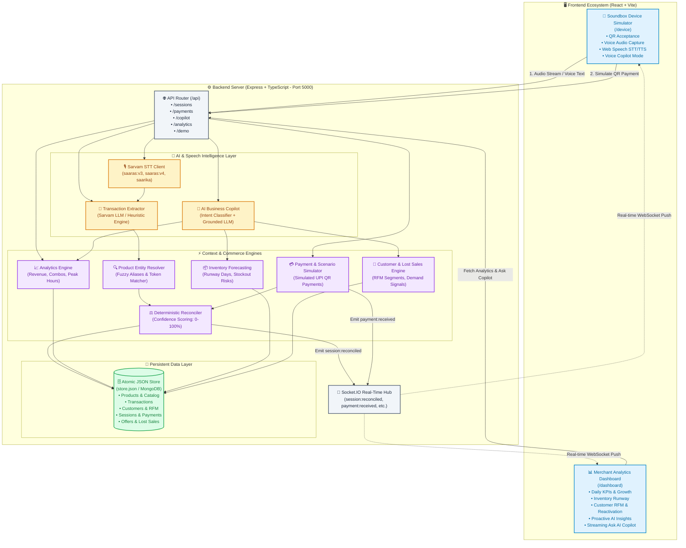
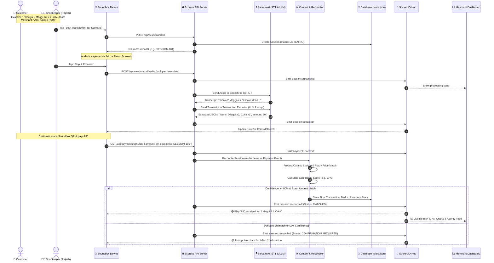
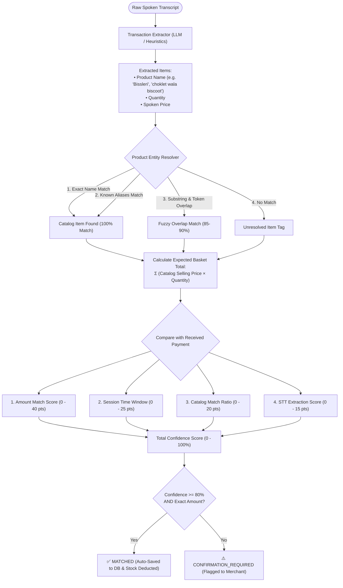
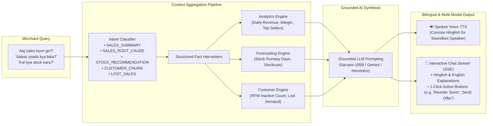
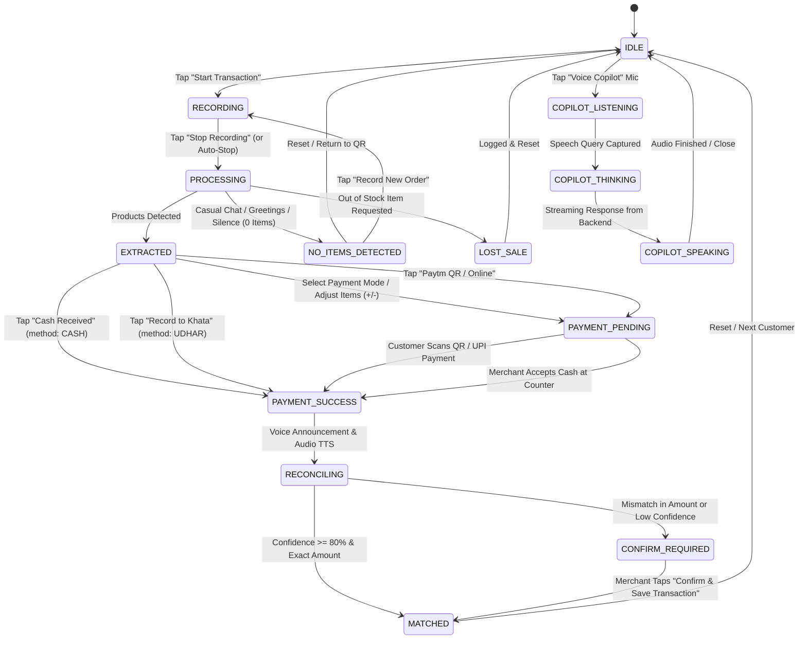
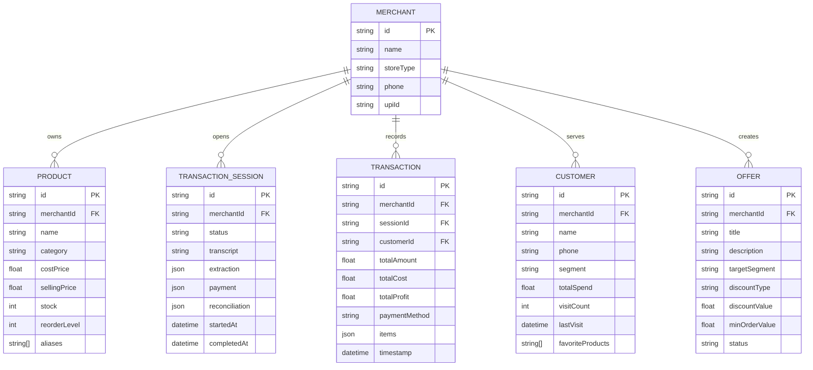

# Paytm Commerce Intelligence (Paytm Vyapar AI) — System Flows & Architecture

This document outlines the complete architectural, transactional, and AI flows of the **Paytm Commerce Intelligence** platform using Mermaid diagrams.

---

## 1. High-Level System Architecture & Component Interactions

This diagram illustrates how the Merchant Soundbox Device, Backend API, AI Services, Storage, and Merchant Dashboard interact in real-time.

---

## 2. End-to-End Transaction & Audio Reconciliation Flow

This sequence diagram depicts what happens when a customer orders at the counter, how the audio is processed, matched with the payment, and broadcast to the dashboard.

---

## 3. Product Entity Resolution & Reconciliation Logic

How the system maps spoken informal terms to the inventory catalog and calculates match confidence.

---

## 4. AI Business Copilot & Intelligence Engine Flow

This diagram illustrates how natural language questions (in Hinglish or English) are answered using strictly grounded business facts.

---

## 5. Soundbox Device State Machine

The complete lifecycle of states managed on the Soundbox device simulator.

---

## 6. Entity Relationship Diagram (Data Models)

The core data schema maintained in the persistent database:

---

*Feel free to review, edit, or ask for adjustments to any part of this flow!*
